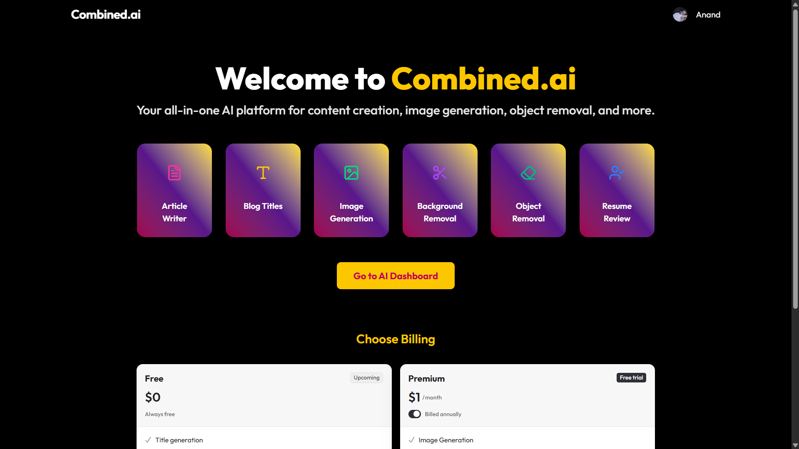
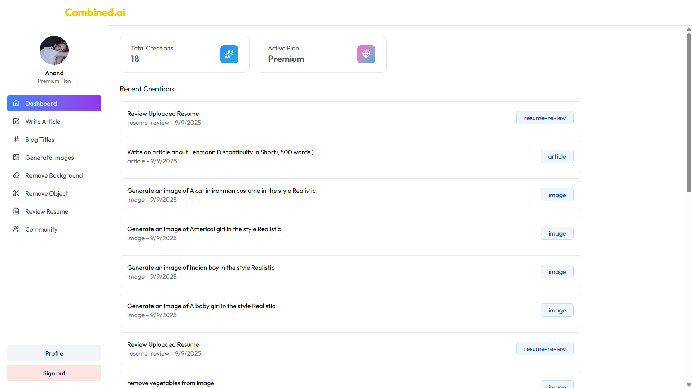
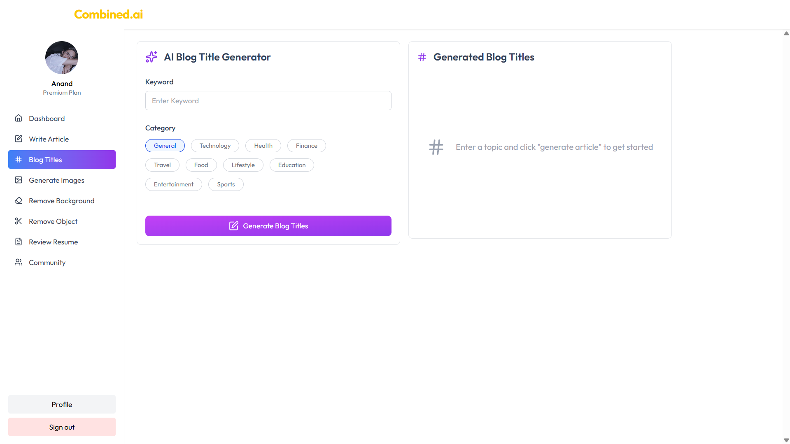
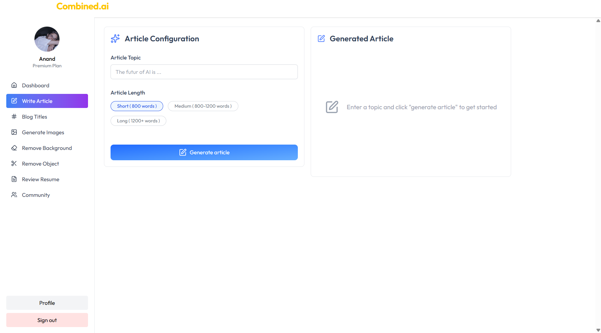
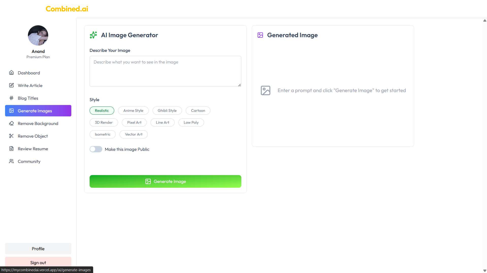
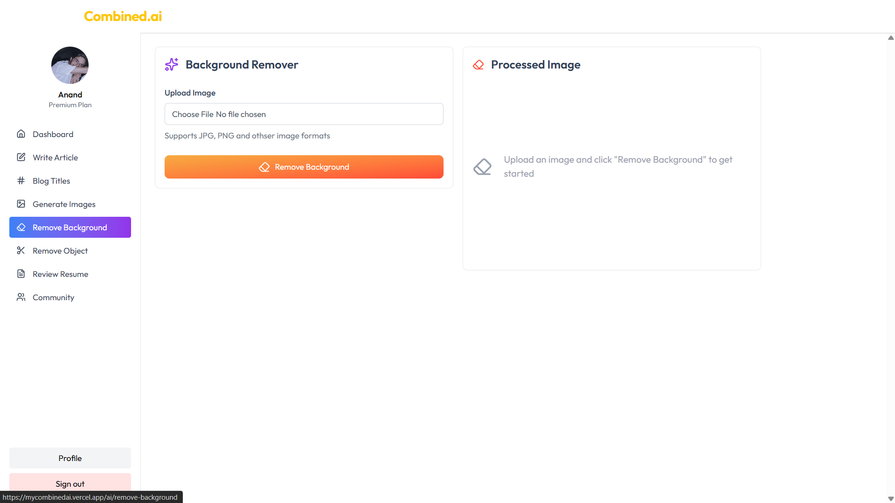
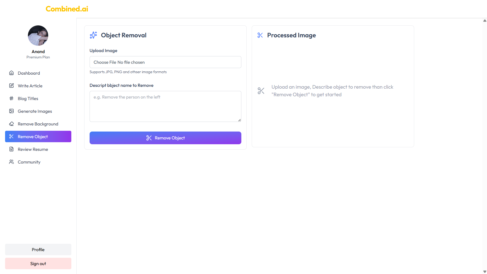
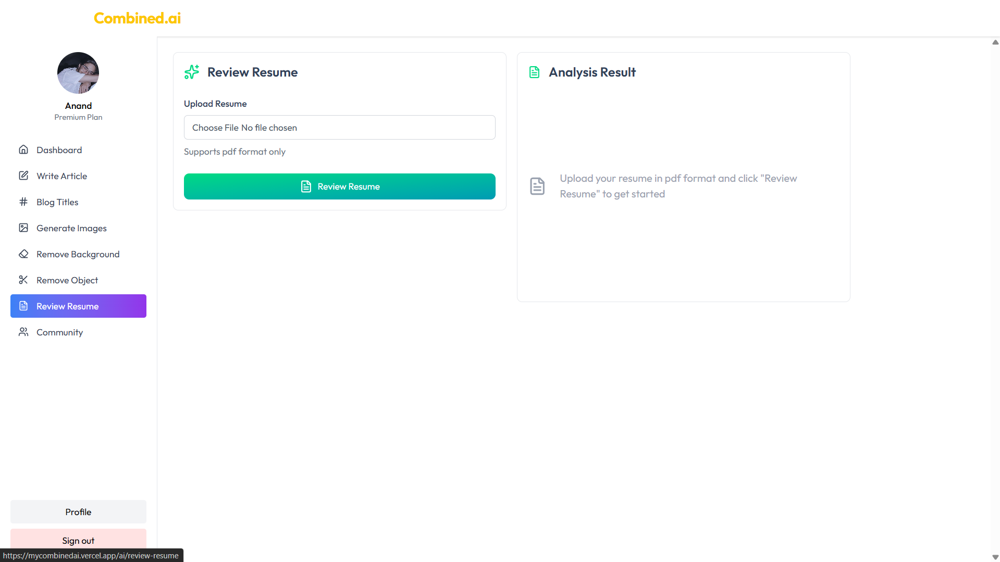
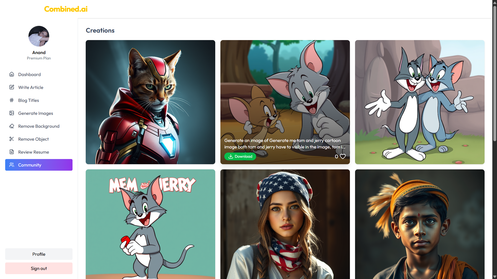

# 🤖 Combined AI – Multi-Tool AI Platform

An **all-in-one AI web application** that brings together multiple AI tools under one roof.  
Built with **Google Gemini**, **ClipDrop AI**, **Cloudinary**, and **Clerk Auth**.

Live Demo: [https://mycombinedai.vercel.app](https://mycombinedai.vercel.app)  
Source Code: [GitHub Repository](https://github.com/AnandIsCoding/Combined-AI)

---

## ✨ Features

- 📝 **Blog Title & Article Generation**  
  Quickly generate engaging titles and full articles powered by Google Gemini.

- 🎨 **Text-to-Image Generation**  
  Create high-quality images from text prompts.

- 🖌 **Background & Object Removal**  
  Clean up or isolate subjects in images using ClipDrop API.

- 📄 **Résumé Analysis**  
  Upload résumés and get instant AI-powered feedback.

- 🌐 **Community Section**  
  Publish your creations, view others’ work, and like posts.

- ☁️ **Cloudinary Integration**  
  All uploaded images are optimized and stored via Cloudinary.

- 🔐 **Clerk Authentication**  
  Secure sign-in and user management built-in.

---

## 🖥️ Screenshots

### 🔑 Authentication & Landing Page

### 🔑 Dashboard

### 📝 Blog Title Generator

### 📝  Article Generator

### 🎨 Text-to-Image Generator

### 🖌 Background & Object Remover

### 📄 Résumé Analysis

### 🌐 Community Section

---

## 🛠️ Tech Stack

- **Frontend:** React + Tailwind CSS  
- **Backend:** Node.js / Express  / PostgreSql 
- **Authentication:** Clerk Auth  
- **Image Hosting:** Cloudinary  
- **LLM:** Google Gemini  
- **Image Processing:** ClipDrop API  
- **Deployment:** Vercel  
